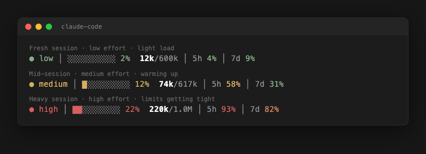

# claude-code-status-bar

A minimalist, color-coded status line for [Claude Code](https://code.claude.com).
It packs the four things you actually glance at — **reasoning effort**,
**context window usage**, **token count**, and **rate limits** — into one
compact line that changes color from green → yellow → orange → red as each value
climbs.



The whole thing is a single self-contained `statusline.sh` (Bash + `jq` + `awk`).
No daemon, no Node, no config file.

---

## What it looks like

Claude Code feeds the script a JSON blob on every redraw; the script prints one
colored line. The screenshot above shows three real states (rendered straight
from the script's own output):

- **Fresh session, light load** — `● low` and everything green.
- **Mid-session, medium effort** — effort and context warming to yellow, the
  5-hour limit at 58%.
- **Heavy session, high effort** — `● high`, context at 22%, the 5-hour limit
  near its cap.

Each segment colors **independently** — effort can be red while your weekly
limit is still green, and vice-versa.

---

## Requirements

- **Claude Code** v2.1.153 or newer (the `effort` field in the status-line JSON
  was added around then; everything else degrades gracefully on older builds).
- `bash`, `jq`, `awk`, `sed` on your `PATH` (all standard on macOS/Linux; on
  macOS install `jq` via `brew install jq`).
- A terminal with 256-color support and a UTF-8 font (for `●`, `█`, `░`, `│`).

---

## Install

### Just paste this prompt into Claude Code

The easiest way — copy the prompt below and paste it into Claude Code. It will
fetch the script, wire it into your settings, and show you a preview, without
touching the rest of your config:

```text
Set up my Claude Code status line from https://github.com/fedddorov/claude-code-status-bar.

1. Download https://raw.githubusercontent.com/fedddorov/claude-code-status-bar/main/statusline.sh
   to ~/.claude/statusline.sh and make it executable (chmod +x).
2. In ~/.claude/settings.json, add (or replace) the "statusLine" key with:
   { "type": "command", "command": "bash ~/.claude/statusline.sh" }
   Use jq and keep all my other existing settings intact; back the file up first.
3. Preview it by piping a sample JSON payload into the script and showing me the
   rendered line, then tell me to restart Claude Code to see it live.
```

### One-liner (clone + run the installer)

```bash
git clone https://github.com/fedddorov/claude-code-status-bar.git
cd claude-code-status-bar
./install.sh
```

The installer:

1. Copies `statusline.sh` to `~/.claude/statusline.sh` (honors
   `$CLAUDE_CONFIG_DIR` if you set it).
2. Backs up your existing `~/.claude/settings.json`, then adds **only** the
   `statusLine` key — all your other settings are left untouched.

Restart Claude Code (or open a new session) and the bar appears.

### Manual

1. Copy `statusline.sh` to `~/.claude/statusline.sh` and `chmod +x` it.
2. Add this to `~/.claude/settings.json`:

   ```json
   {
     "statusLine": {
       "type": "command",
       "command": "bash ~/.claude/statusline.sh"
     }
   }
   ```

### Try it without installing

You can pipe a fake payload straight into the script to preview a state:

```bash
echo '{
  "effort": { "level": "high" },
  "context_window": {
    "used_percentage": 18,
    "total_input_tokens": 110000,
    "total_output_tokens": 17000
  },
  "rate_limits": {
    "five_hour": { "used_percentage": 62 },
    "seven_day": { "used_percentage": 24 }
  }
}' | COLUMNS=80 bash statusline.sh
```

Change the numbers to watch the colors cross the thresholds below.

---

## Anatomy

Left to right, the line is built from these segments (separated by a dim `│`):

```
●  high   │   ██░░░░░░░░  18%   │   127k / 1.0M   │   5h 62%   │   7d 24%
└──┬───┘       └────┬────┘ └┬┘       └──┬──┘ └─┬┘     └──┬──┘     └──┬──┘
reasoning      context bar  ctx%     used   max      5-hour      7-day
 effort       (10 cells)            tokens  ctx      limit       limit
```

| Segment | Glyph | Meaning | Source field |
|---|---|---|---|
| **Reasoning effort** | `● low` / `medium` / `high` | Current `/effort` level. Hidden if the model has no effort setting. | `effort.level` |
| **Context bar** | `██░░░░░░░░` | 10-cell bar; each cell ≈ 10% of the context window consumed. | `context_window.used_percentage` |
| **Context %** | `18%` | Exact percentage of the context window in use. | `context_window.used_percentage` |
| **Tokens used / max** | `127k/1.0M` | Tokens used so far (bright) over the window size (dim). | `context_window.total_input_tokens` + `total_output_tokens` |
| **5h limit** | `5h 62%` | Percentage of the 5-hour rate limit consumed. Hidden if unavailable. | `rate_limits.five_hour.used_percentage` |
| **7d limit** | `7d 24%` | Percentage of the 7-day (weekly) rate limit consumed. Hidden if unavailable. | `rate_limits.seven_day.used_percentage` |

The line is **left-aligned** — segments render in the order above and the line
is printed as-is, with no padding.

---

## Color thresholds — when does it change color?

There are three independent color scales. All use the same four muted tones:

| Tone | 256-color | Sample |
|---|---|---|
| Green  | `108` (soft sage)  | 🟢 |
| Yellow | `179` (muted gold) | 🟡 |
| Orange | `173` (soft amber) | 🟠 |
| Red    | `167` (soft rose)  | 🔴 |

### 1. Reasoning effort

Three colors, by level (color carries the intensity; the word disambiguates):

| Level | Color |
|---|---|
| `low` | 🟢 Green |
| `medium` | 🟡 Yellow |
| `high`, `xhigh`, `max` | 🔴 Red |

### 2. Context window usage

Applies to **both** the bar and the `%`. Thresholds are low on purpose — on a
1M-token window even "20%" is a lot of tokens, and it's a nudge to wrap up or
`/compact` before quality degrades.

| Usage | Color |
|---|---|
| `< 10%` | 🟢 Green |
| `10–14%` | 🟡 Yellow |
| `15–19%` | 🟠 Orange |
| `≥ 20%` | 🔴 Red |

### 3. Rate limits (5h and 7d)

| Usage | Color |
|---|---|
| `< 50%` | 🟢 Green |
| `50–79%` | 🟡 Yellow |
| `80–89%` | 🟠 Orange |
| `≥ 90%` | 🔴 Red |

> Labels (`5h`, `7d`, `/max`) and separators are always dim grey — only the
> values carry color, so your eye goes straight to the number that matters.

---

## Customizing

Everything lives in `statusline.sh` and is easy to tweak:

- **Palette** — edit the `GRN` / `YEL` / `ORG` / `RED` 256-color codes near the
  top.
- **Thresholds** — edit the `hue` (rate limits), `hue_ctx` (context), and
  `hue_eff` (effort) functions.
- **Effort label** — the effort segment prints `● <level>`. To shorten it (e.g.
  first letter only), change the line that builds `out` in the effort block.
- **Alignment** — the bar is left-aligned (the script ends with `echo "$out"`).
  To right-align it instead, replace that final line with a block that pads
  `$out` on the left up to `$COLUMNS` (subtract the visible width — i.e. ANSI
  stripped, multi-byte glyphs counted as one column).

---

## How it works (under the hood)

- Reads the status-line JSON from stdin, extracts fields with `jq`.
- `fmt_tok` renders token counts compactly (`1234` → `1k`, `1500000` → `1.5M`).
- `hue*` helpers map a number/level to an ANSI color via `awk` / `case`.
- The context bar is 10 cells; filled count is `round(used% / 10)`.
- The final line is printed as-is (`echo "$out"`), so it sits at the left edge
  of the status area.

---

## License

[MIT](./LICENSE) © Sviatoslav Fedorov
